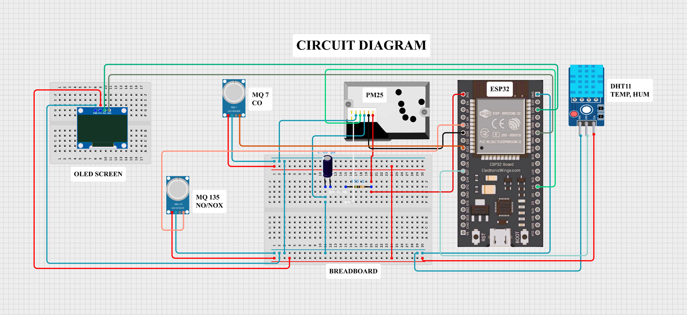

# 🌍 Aqi-ESP — Smart IoT AQI Monitoring System

<p align="center">
  <strong>Real-Time Air Quality Monitoring with ESP32, MicroPython & Flask</strong>
</p>

<p align="center">
  
  
  
  
  
</p>

<p align="center">
  An end-to-end IoT air-quality monitoring system that collects sensor data using an ESP32,
  transmits it over Wi-Fi to a Flask backend, calculates an AQI value, and displays
  the resulting air-quality information on an SSD1306 OLED display.
</p>

---

## 📌 Table of Contents

* [Overview](#-overview)
* [Key Features](#-key-features)
* [System Architecture](#-system-architecture)
* [Hardware](#-hardware)
* [Software Stack](#-software-stack)
* [How It Works](#-how-it-works)
* [Pin Configuration](#-pin-configuration)
* [API](#-api)
* [Getting Started](#-getting-started)
* [AQI Classification](#-aqi-classification)
* [Project Structure](#-project-structure)
* [Technical Highlights](#-technical-highlights)
* [Future Roadmap](#-future-roadmap)
* [Author](#-author)

---

## 🔎 Overview

**Aqi-ESP** is a real-time IoT air-quality monitoring system built around an **ESP32**.

The system integrates multiple environmental sensors to collect air-quality measurements along with temperature and humidity data. The ESP32 communicates with a **Flask backend over Wi-Fi using HTTP/JSON**, where the received sensor data is processed to calculate an AQI value and corresponding air-quality status.

The resulting information is sent back to the ESP32 and presented locally through an **SSD1306 128×64 OLED display**.

### Core Data Flow

```text
┌──────────────────────┐
│      Sensors         │
│                      │
│  MQ-135   MQ-7       │
│  PM2.5    DHT11      │
└──────────┬───────────┘
           │
           ▼
┌──────────────────────┐
│        ESP32         │
│                      │
│ ADC + Sensor Reading │
│ MicroPython          │
└──────────┬───────────┘
           │
           │ Wi-Fi
           │ HTTP POST / JSON
           ▼
┌──────────────────────┐
│    Flask Backend     │
│                      │
│ Data Processing      │
│ AQI Calculation      │
│ Status Classification│
└──────────┬───────────┘
           │
           │ JSON Response
           ▼
┌──────────────────────┐
│        ESP32         │
└──────────┬───────────┘
           │
           ▼
┌──────────────────────┐
│    SSD1306 OLED      │
│                      │
│ AQI                  │
│ Status               │
│ Temperature          │
│ Humidity             │
└──────────────────────┘
```

---

## ✨ Key Features

* 🌫️ Real-time air-quality monitoring
* 📊 AQI calculation using multiple sensor inputs
* 🌡️ Temperature and humidity monitoring
* 📟 Live SSD1306 OLED visualization
* 📡 Wi-Fi communication between ESP32 and server
* 🔄 HTTP POST communication using JSON
* 🐍 Flask-based backend for AQI computation
* 🔌 Multi-sensor analog and digital interfacing
* 📈 AQI status classification
* 🧩 Modular ESP32 + backend architecture

---

## 🧰 Hardware

| Component        | Purpose                                     |
| ---------------- | ------------------------------------------- |
| **ESP32**        | Main microcontroller and communication unit |
| **MQ-135**       | Gas sensing / NO and NOx input              |
| **MQ-7**         | Carbon monoxide (CO) sensing                |
| **GP2Y1010AU0F** | PM2.5 / dust sensing                        |
| **DHT11**        | Temperature and humidity monitoring         |
| **SSD1306 OLED** | Local real-time display                     |
| **Jumper Wires** | Hardware connections                        |

---

## 💻 Software Stack

### Embedded

* **MicroPython**
* ESP32
* ADC
* GPIO
* I²C
* HTTP communication

### Backend

* **Python**
* **Flask**
* JSON API
* AQI processing

---

## ⚙️ How It Works

### 1. Sensor Acquisition

The ESP32 collects readings from:

* MQ-135
* MQ-7
* GP2Y1010AU0F
* DHT11

Analog sensors are connected to ESP32 ADC-capable GPIOs.

### 2. Data Transmission

The ESP32 connects to a Wi-Fi network and sends the collected sensor values to the Flask server using an HTTP `POST` request.

The payload is formatted as JSON.

### 3. Backend Processing

The Flask backend receives the sensor readings and:

1. Processes the incoming values.
2. Converts the raw sensor values into AQI-related values.
3. Calculates the overall AQI.
4. Determines the corresponding air-quality status.
5. Returns the result as JSON.

### 4. Local Visualization

The ESP32 receives the backend response and displays:

* AQI
* AQI status
* Temperature
* Humidity

on the SSD1306 OLED.

---

## 🔌 ESP32 Pin Configuration

| Sensor / Module   | ESP32 Pin | Function                |
| ----------------- | --------: | ----------------------- |
| MQ-135 AO         |   GPIO 34 | Analog gas reading      |
| MQ-7 AO           |   GPIO 33 | Analog CO reading       |
| PM2.5 Analog Out  |   GPIO 35 | Analog dust reading     |
| PM2.5 LED Control |    GPIO 4 | PM sensor pulse control |
| DHT11 Data        |   GPIO 27 | Temperature & humidity  |
| OLED SDA          |   GPIO 21 | I²C data                |
| OLED SCL          |   GPIO 22 | I²C clock               |

### Circuit Diagram



---

## 🔗 API

The ESP32 communicates with the Flask backend through:

```text
POST /predict
```

### Request

```json
{
  "no": 1024,
  "co": 860,
  "nox": 1024,
  "pm25": 0.85
}
```

### Response

```json
{
  "predicted_aqi": 104.5,
  "status": "Unhealthy"
}
```

### Communication Flow

```text
ESP32
  │
  │ HTTP POST + JSON
  ▼
Flask /predict
  │
  │ AQI processing
  ▼
AQI + Status
  │
  │ JSON Response
  ▼
ESP32
  │
  ▼
OLED Display
```

---

## 🚀 Getting Started

### Prerequisites

You will need:

* ESP32 development board
* MicroPython firmware
* Required sensors and OLED
* Python 3.x
* Wi-Fi network

---

### 1. Clone the Repository

```bash
git clone <YOUR_REPOSITORY_URL>
cd Aqi-ESP
```

> Replace `<YOUR_REPOSITORY_URL>` with the actual repository URL.

---

### 2. Install Flask

```bash
pip install flask
```

---

### 3. Start the Backend

Run:

```bash
python app.py
```

The Flask server should now be ready to receive requests from the ESP32.

---

### 4. Configure the ESP32

Flash **MicroPython** onto the ESP32 and upload:

```text
main.py
ssd1306.py
```

Update the following configuration values in `main.py`:

```python
SSID = "YOUR_WIFI_NAME"
PASSWORD = "YOUR_WIFI_PASSWORD"
SERVER_URL = "YOUR_SERVER_URL"
```

Then reset the ESP32.

---

## 📊 AQI Classification

|     AQI Range | Status       |
| ------------: | ------------ |
|    **0 – 50** | 🟢 Good      |
|  **51 – 100** | 🟡 Moderate  |
| **101 – 200** | 🟠 Unhealthy |
|      **201+** | 🔴 Hazardous |

> **Note:** The AQI calculation in this project is based on the project's implemented sensor-processing logic. For deployment as a calibrated environmental monitoring instrument, sensor calibration and an appropriate regulatory AQI methodology would need to be validated separately.

---

## 📁 Project Structure

```text
Aqi-ESP/
│
├── Circuit_Diagram/
│   └── circuit_image.png
│
├── main.py
├── ssd1306.py
├── app.py
├── README.md
└── ...
```

> Adjust the structure above if the actual repository contains additional files or directories.

---

## 🧠 Technical Highlights

### Embedded Systems

* ESP32 microcontroller
* MicroPython firmware
* ADC-based sensor acquisition
* GPIO control
* I²C communication
* Real-time OLED output

### IoT Communication

* Wi-Fi connectivity
* HTTP client-server communication
* JSON data exchange
* ESP32-to-server integration

### Backend Development

* Python Flask server
* REST-style API endpoint
* JSON request/response handling
* AQI processing

### Hardware Integration

* Multiple gas sensors
* PM2.5 sensor
* Temperature/humidity sensor
* OLED display
* Mixed analog/digital interfaces

---

## 🗺️ Future Roadmap

The following improvements can extend the system beyond the current implementation:

### ☁️ Cloud Integration

* Firebase
* AWS IoT
* Cloud-based data storage

### 📱 Remote Monitoring

* Mobile dashboard
* Browser-based visualization
* Remote monitoring interface

### 🔔 Notifications

* Email alerts
* WhatsApp/other messaging integration
* Threshold-based notifications

### 📈 Data Analytics

* Historical data logging
* AQI trend graphs
* Long-term air-quality analysis

---

## 🎯 Project Applications

Potential applications include:

* 🏠 Indoor air-quality monitoring
* 🏢 Smart-building monitoring
* 🏭 Environmental monitoring prototypes
* 🏫 Educational IoT systems
* 🌐 Connected sensor networks
* 🔬 Embedded/IoT experimentation

---

## 👨‍💻 Author

**Suayush Kumar Das**

B.Tech — Electronics & Communication Engineering
ITER, SOA University

**Areas of Interest**

`Embedded Systems` · `IoT` · `Automation` · `ESP32` · `Python` · `MicroPython`

---

<p align="center">
  ⭐ If you found this project useful, consider starring the repository!
</p>
